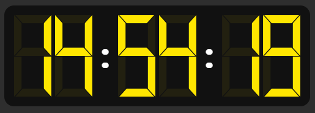

# 🕒 Digital Clock

Bem-vindo ao projeto **Digital Clock**! Este é um relógio digital simples, criado para aprimorar e praticar meus conhecimentos em **JavaScript**, **HTML** e **CSS**.

---

## 🚀 Como utilizar

1. **Clone o repositório:**
    ```bash
    git clone https://github.com/AlexanderDuarte/digital-clock.git
    ```
2. **Acesse a pasta do projeto:**
    ```bash
    cd digital-clock
    ```
3. **Abra o arquivo `index.html`** no seu navegador favorito.

---

## 👀 Visualização

Veja abaixo um exemplo de como o relógio aparece em funcionamento:



---

## 🛠️ Tecnologias utilizadas

- **HTML**: Estrutura da página
- **CSS**: Estilização do relógio
- **JavaScript**: Lógica para atualizar o horário em tempo real

---

## 💡 Objetivo

Este projeto foi desenvolvido como parte do meu processo de aprendizado e prática em desenvolvimento web. O foco é consolidar conceitos de manipulação do DOM, estilização responsiva e lógica de atualização dinâmica.

---

## 📄 Licença

Este projeto está sob a licença MIT.

---

> Sinta-se à vontade para contribuir, sugerir melhorias ou utilizar este projeto como base para seus estudos!
